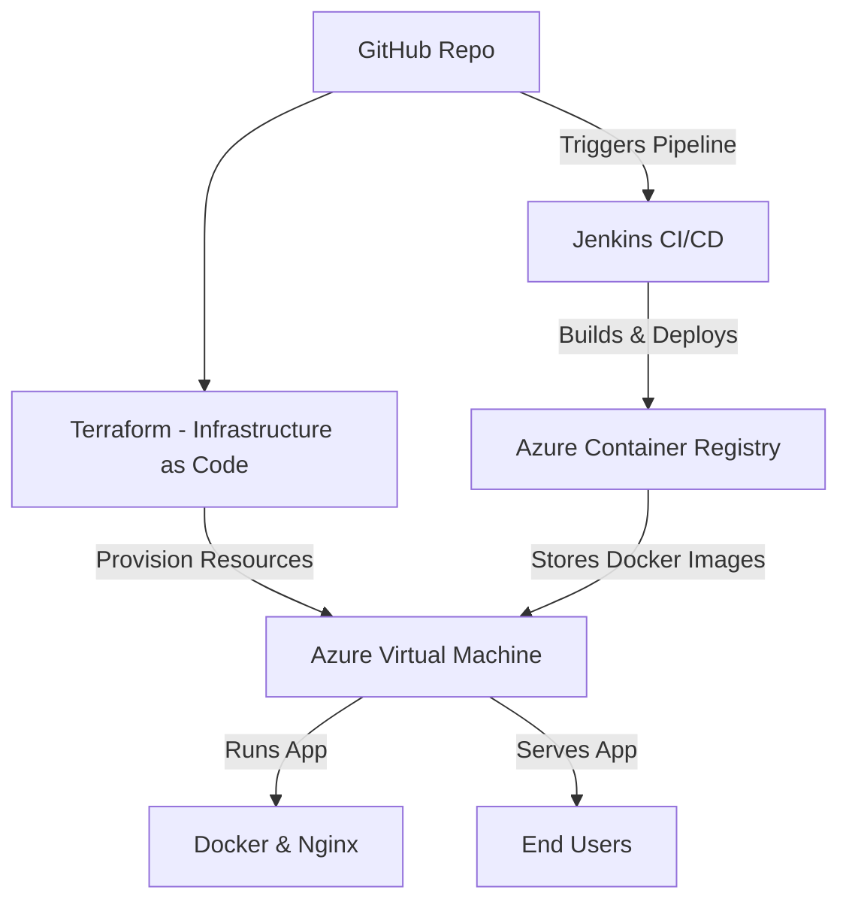

# Architecture Overview

## Introduction
This document outlines the architecture of the Converter DevOps Project and details how the application is deployed, managed, and automated using Terraform, Jenkins, Docker, Azure, and Nginx.

## High-Level Architecture
The project follows an Infrastructure as Code (IaC) & CI/CD approach, ensuring automated provisioning, deployment, and management. Below is the workflow:

### Infrastructure Setup (Terraform)
1. Terraform provisions:  
Azure Virtual Machine (VM)  
Azure Container Registry (ACR)  
Networking components (VNet, NSG, Public IP)  
Storage (if needed)

### CI/CD Deployment Flow (Jenkins)
1. Developer pushes code to GitHub
2. Jenkins triggers the pipeline  
- Builds a Docker image  
- Pushes the image to Azure Container Registry (ACR)  
- SSHs into an Azure Virtual Machine (VM)  
- Pulls the latest Docker image from ACR  
- Restarts the application container
4. Application runs on the VM, exposed via Nginx reverse proxy

### Architecture Diagram

### Components & Technologies

| **Component** | **Purpose** |
|--------------|------------|
| **Terraform** | Automates infrastructure provisioning (Azure VM, ACR, networking) |
| **GitHub** | Stores the project source code |
| **Jenkins** | Automates the CI/CD pipeline |
| **Docker** | Containerizes the application |
| **Azure Container Registry (ACR)** | Stores the Docker images |
| **Azure VM** | Runs the containerized application |
| **Nginx** | Acts as a reverse proxy for the app |
| **SSH & SCP** | Used for secure connection & file transfer |

### Deployment Flow
1. Infrastructure Provisioning (Terraform)
- Run `terraform apply` to create Azure resources:
    - VM
    - ACR
    - Networking components (VNet, NSG)
- VM is configured with Docker & Nginx.
  
2. Application Deployment (Jenkins CI/CD)
- Jenkins triggers build when code is pushed to GitHub
- Builds & pushes the Docker image to Azure Container Registry
- SSHs into Azure VM and pulls the latest image
- Restarts the container and serves it through Nginx
- Application is accessible via public IP/domain

  
### Future Enhancements
- Move from VM to Kubernetes (AKS)
- Use Terraform to automate the full CI/CD setup
- Add monitoring with Prometheus & Grafana
- Use Azure Key Vault for secrets management
